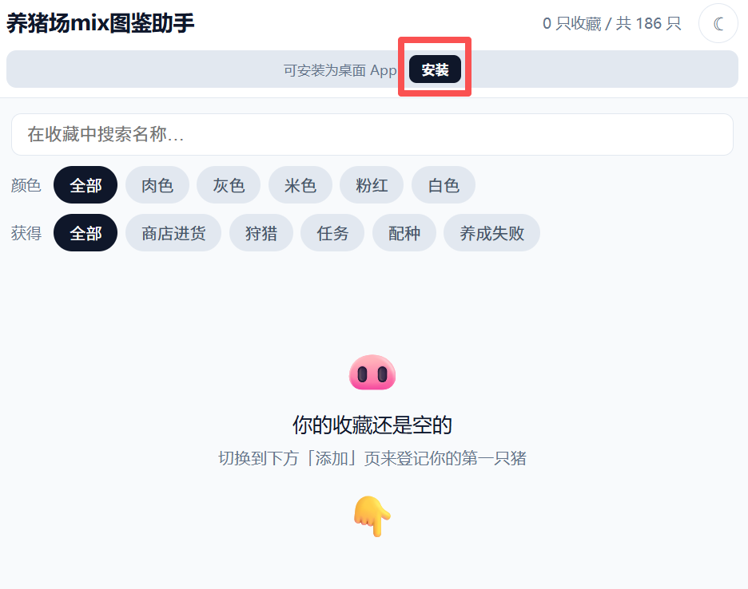
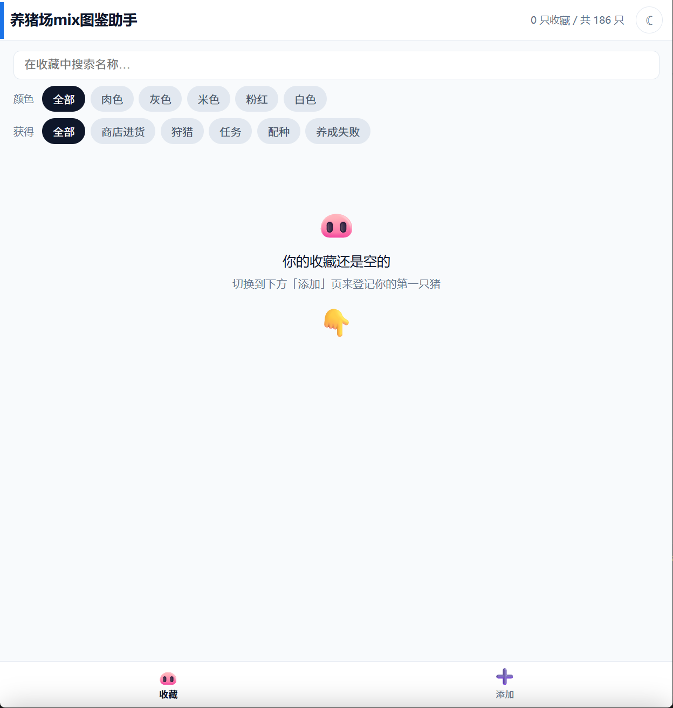
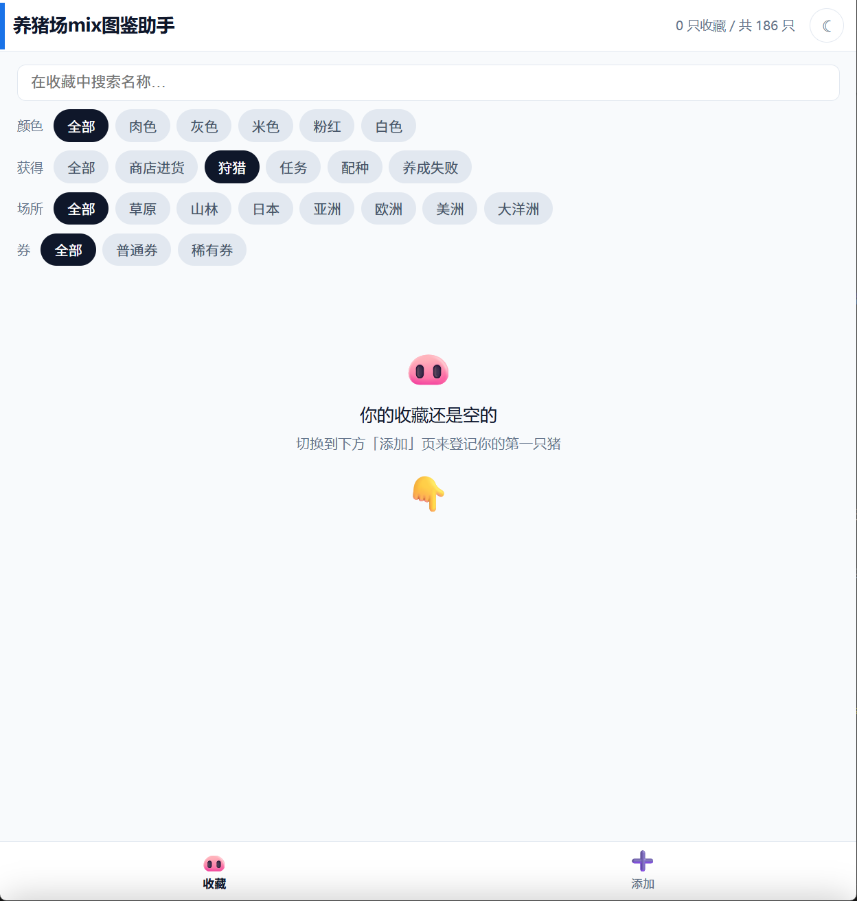
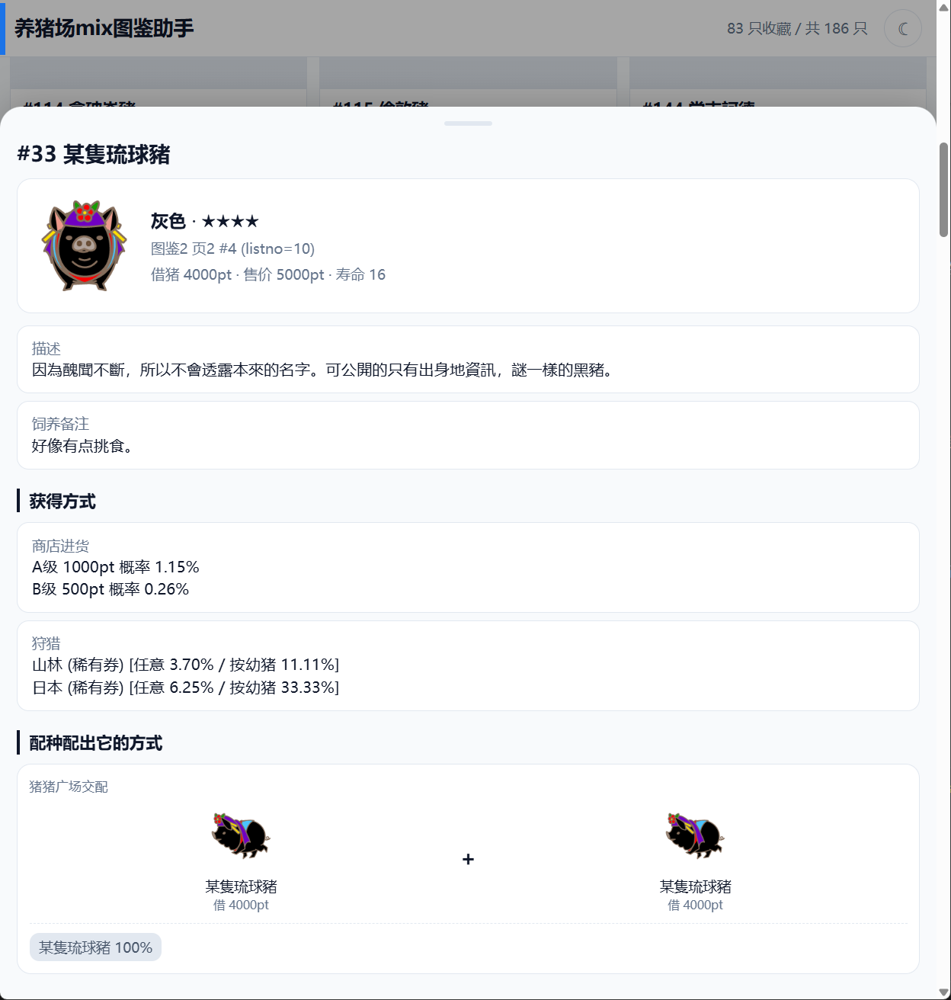
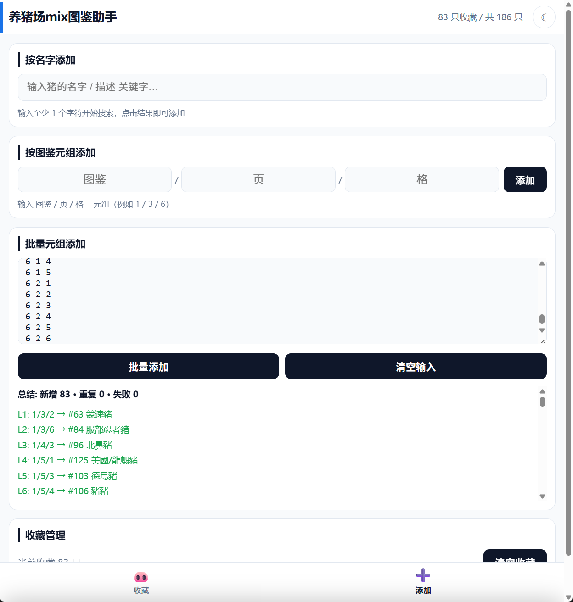

<p align="center">
  
</p>

<h1 align="center">养猪场mix图鉴助手 · 使用手册</h1>

<p align="center">
  一个跑在浏览器里的小 PWA，帮你整理《养猪场MIX》186 只图鉴的收藏进度。<br>
  数据取自 <a href="https://pigfarmmix.net/">pigfarmmix.net</a>，收藏记录只存在你自己设备的 localStorage 里。
</p>

---

## 📖 目录

- [快速开始](#-快速开始)
- [安装到手机主屏幕（PWA）](#-安装到手机主屏幕pwa)
- [界面总览](#-界面总览)
- [收藏 Tab：浏览 & 筛选](#-收藏-tab浏览--筛选)
  - [颜色筛选](#颜色筛选)
  - [获得方式筛选](#获得方式筛选)
  - [狩猎子筛选（场所 + 券）](#狩猎子筛选场所--券)
  - [商店子筛选（A/B/C 级）](#商店子筛选abc-级)
  - [搜索](#搜索)
  - [猪只详情抽屉](#猪只详情抽屉)
- [添加 Tab：录入收藏](#-添加-tab录入收藏)
  - [方式 1：图鉴 / 页 / 格](#方式-1图鉴--页--格)
  - [方式 2：按名称搜索](#方式-2按名称搜索)
  - [方式 3：批量三元组](#方式-3批量三元组)
  - [导出 / 导入配置](#导出--导入配置)
  - [清空收藏](#清空收藏)
- [主题切换](#-主题切换)
- [常见问题](#-常见问题)

---

## 🚀 快速开始

1. 用浏览器打开部署好的站点。
2. 等图鉴数据加载完（首次约 1~2 秒，之后会被 Service Worker 缓存到本地）。
3. 下方 tab 栏切到 **「添加」**，登记你游戏里的猪。
4. 切回 **「收藏」** 就能看到卡片网格 + 各种筛选。

> 💾 **数据只存在本机**。换设备/浏览器/清缓存 → 收藏会丢。要搬家用「添加」tab 底部的 [导出 / 导入配置](#导出--导入配置) 一键备份恢复。

---

## 📱 安装到手机主屏幕（PWA）

本站是 PWA（Progressive Web App），可以像原生 App 一样装到主屏幕、离线使用。

### iOS / iPhone

1. 用 **Safari** 打开站点
2. 点底部分享按钮 <kbd>⎙</kbd>
3. 选择 **「加入主画面 / Add to Home Screen」**
4. 主屏幕上会出现彩虹猪图标 🐽

### Android / Chrome

1. Chrome 打开站点
2. 页面顶部会弹 **「安装」** 条，或从右上角菜单 <kbd>⋮</kbd> → **「安装应用 / 添加到主屏幕」**
3. 或者直接点页面顶部自带的 **「安装」** 按钮（见图）




---

## 🧭 界面总览

整站只有两个 tab，底部 tab 栏切换：

```
┌──────────────────────────────────────┐
│   养猪场mix图鉴助手    12 / 186  ☾    │ ← 顶部：标题 / 进度计数 / 主题切换
├──────────────────────────────────────┤
│   🔍 搜索框                          │
│   颜色 · [全部][肉色][灰色]…          │ ← 筛选区
│   获得 · [全部][商店][狩猎]…          │
│   (狩猎/商店子筛选会按需出现)          │
│   统计条：显示当前筛选剩余几只         │
├──────────────────────────────────────┤
│                                      │
│          猪卡片网格 / 详情            │ ← 主体
│                                      │
├──────────────────────────────────────┤
│         🐽 收藏      ➕ 添加         │ ← 底部 tab 栏
└──────────────────────────────────────┘
```




---

## 🐽 收藏 Tab：浏览 & 筛选

默认进来就是这里。没有收藏时会显示一张「你的收藏还是空的」空态，点它可以直接跳到添加页。

有收藏后按 **图鉴 → 页 → 格** 排序展示成网格。每张卡有：

- 猪的图
- `#pNo 名字`
- 稀有度 `★` / `✦`
- 颜色小点
- 右上角 `图鉴X · 页Y · 格Z` 徽章

点任意一张 → 从下方滑出 **详情抽屉**（下文）。

### 颜色筛选

顶部第一行 chip，按颜色缩小范围：

```
颜色 · [全部] [肉色] [灰色] [米色] [粉红] [白色] [野猪色]
```

### 获得方式筛选

第二行 chip：

```
获得 · [全部] [商店进货] [狩猎] [配种] [养成失败]
```

筛选只有「这种途径能获得」的猪。逻辑就是是否有对应字段（例如 `arrival_place` 非空 = 能狩猎）。

### 狩猎子筛选（场所 + 券）

**只有** 选中 `获得 → 狩猎` 时才会出现两行额外筛选：

```
场所 · [全部] [草原] [山林] [日本] [亚洲] [欧洲] [美洲] [大洋洲]
券   · [全部] [普通券] [稀有券]
```

两行 **AND 生效**：比如「日本 + 稀有券」只会剩下在日本稀有券能打到的那几只。切到别的获得方式，这两行会自动收起并重置。



### 商店子筛选（A/B/C 级）

选中 `获得 → 商店进货` 时出现：

```
进货等级 · [全部] [A级 (1000pt)] [B级 (500pt)] [C级 (100pt)]
```

只留下在对应等级有正概率 (`add_rank[i] > 0`) 的猪。

### 搜索

最上方那个搜索框，对 **当前收藏** 的名字 + 描述做实时子串匹配，和上面的 chip 筛选叠加生效。

### 猪只详情抽屉

点卡片 → 从下方滑出来的半屏抽屉，里面会显示：

- **大图 + 基本信息**：编号、名字、颜色、稀有度、图鉴位置、借猪费用、售价
- **获得方式**：商店各等级概率 / 狩猎场所和券种 / 养成失败可得自…
- **配种组合**：所有能配出这只猪的组合，按 `猪猪广场交配` / `系统图交换所` / `活动限定` 分组；每条显示双亲、借猪费、产物概率；系统图会标订单号和兑换券数量
- **它能配出的崽**：反向列出「这只猪作为父本之一」时的所有配方；对 **活动猪** 产出会在概率 chip 旁边附一个 `☐ 未有 / ☑ 已有` 勾选，单独存在 `localStorage` 的 `pig_owned_event_v1` 里，不影响 186 主猪的收藏
- **从收藏移除** 按钮（红色，底部）

向下拉抽把手可以关掉。



---

## ➕ 添加 Tab：录入收藏

底部 tab 栏 → `➕ 添加`。这页提供三种录入方式。

### 方式 1：图鉴 / 页 / 格

按游戏图鉴的三元组输入：

```
[图鉴 1~6] / [页 ≥1] / [格 1~6]       [添加]
```

- 输入合法后「添加」按钮亮起
- 输完 **图鉴** 自动跳到 **页**；输完 **页** 自动跳到 **格**；输完 **格** 焦点跳到「添加」
- 回车可以直接触发添加
- 已收藏过同一只会提示并跳过

### 方式 2：按名称搜索

输入框里打中文/日文名的任意片段 → 实时出候选。点任一条就加到收藏。

### 方式 3：批量三元组

想把手上那张纸上的几十条一次导入？用批量框：

```
每行一个三元组，支持 空格 / 逗号 / 斜线 分隔
例如：
1 3 6
2 1 4
3/2/5
4,5,2
```

点 **「批量添加」**：

- 逐行解析，下面的报告会列出 ✅ 添加 / ⚠️ 已有 / ❌ 找不到
- 点 **「清空输入」** 清空文本框



### 导出 / 导入配置

「添加」tab 底部的 **导出 / 导入配置** 区，负责备份和恢复——一次性把 **收藏** 和 **活动猪「已有」勾选** 一起带走。

**导出**

- 点 **「导出」** → 文本框里出现一段 JSON（形如 `{ "type": "pigfarm-helper-backup", "collection": [...], "ownedEventPigs": [...] }`）
- 点 **「复制到剪贴板」** → 直接复制这段 JSON
- 点 **「下载 .json」** → 保存成 `pigfarm-helper-backup-<时间戳>.json` 本地文件，适合做长期备份

**导入**

把之前导出的 JSON 粘贴到下方「导入」文本框（或点 **「选择文件…」** 挑一份之前下载的 `.json` 备份），然后选一种导入方式：

- **合并导入**：只追加你当前没有的项，旧数据保留不动（推荐）
- **覆盖导入**：弹原生 `confirm` 确认后，用导入的数据 **完全替换** 当前收藏和「已有」勾选（⚠️ 不可恢复）
- **清空输入**：清掉文本框

> 🧰 **兼容旧格式**：如果粘贴的不是 JSON 而是老版「图鉴/页/格」三元组列表（每行一条，`#` 开头是注释），也能识别，但只会恢复收藏部分、不会恢复「已有」勾选。

### 清空收藏

最底部 **收藏管理** 区的「清空收藏」按钮 —— 点击会弹原生 `confirm` 确认框，确认后清空当前所有收藏。⚠️ 无法恢复（活动猪「已有」勾选不会被一起清掉，要单独在 DevTools 里删 `pig_owned_event_v1`，或用「覆盖导入」一份空配置）。

---

## 🌓 主题切换

顶部右上角的月亮/太阳图标 `☾ / ☀`：

- 第一次打开跟随系统主题
- 手动点一下会切到相反主题并记住（写 `localStorage.theme`）
- 再点回原色会清掉偏好、重新跟随系统

---

## ❓ 常见问题

**Q：收藏能在多个设备间同步吗？**
A：不能。纯本地存储，不走任何后端。搬家推荐用「添加」tab 里的 [导出 / 导入配置](#导出--导入配置)——一键备份收藏 + 活动猪「已有」勾选，跨设备恢复。底层两个 localStorage key：`pig_collection_v1`（主猪收藏，pNo 数组）、`pig_owned_event_v1`（活动猪已有，pNo 数组）。

**Q：离线用能翻全部图鉴信息吗？**
A：能。首次联网加载后 Service Worker 会把 `pigs.json` 和 UI 壳子缓存下来；远端的猪图也会按需缓存。完全断网也能翻你已经加载过的任意猪的详情。

**Q：装到主屏幕后图标还是旧的？**
A：系统/浏览器会缓存图标。解决：

1. 长按图标 → 删除
2. 浏览器里打开 DevTools → Application → Storage → **Clear site data**
3. 重新打开站点 → 再装一次

**Q：顶部计数 `12 / 186` 里的 186 是怎么算的？**
A：186种常驻普通图鉴